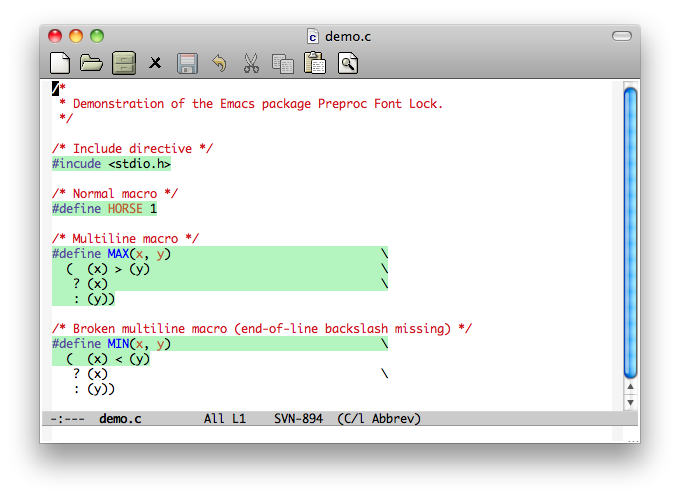

# preproc-font-lock - Highlight C-style preprocessor directives

*Author:* Anders Lindgren 
*Version:* 0.0.3 
*URL:* [https://github.com/Lindydancer/preproc-font-lock](https://github.com/Lindydancer/preproc-font-lock) 

*Preproc Font Lock* is an Emacs package that highlight C-style
preprocessor directives. The main feature is support for macros
that span multiple lines.

Preproc Font Lock is implemented as two minor modes:
`preproc-font-lock-mode` and `preproc-font-lock-global-mode`. The
former can be applied to individual buffers and the latter to all
buffers.

## Installation

This package is designed to be installed as a "package". Once
installed, it is automatically activated.

## Customization

You can customize this package using the following:

* `preproc-font-lock-face` -- The *face* used to highlight the
  preprocessor directive
* `preproc-font-lock-modes` -- A list of major modes. A buffer is
  highlighted if it's major mode is, or is derived from, a member
  of this list.

## Example

Below is a screenshot of a sample C file, demonstrating the effect
of this package:

---
Converted from `preproc-font-lock.el` by [*el2markdown*](https://github.com/Lindydancer/el2markdown).
